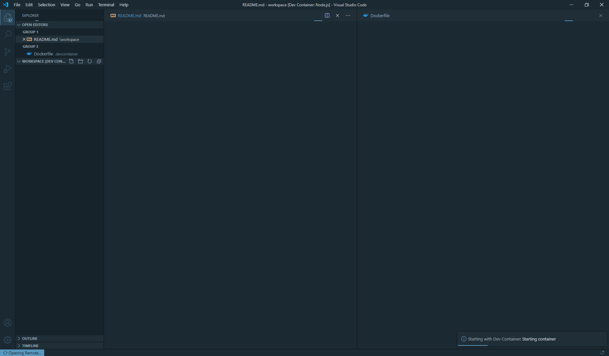

# Visual Studio Code Dev Container Tutorial

## Intro

> The **Visual Studio Code Remote - Containers** extension lets you use
> a Docker container as a full-featured development environment.

It is a hassle to install correct versions of software tools
and keep them updated during your development.
By combining **Docker** and **VSCode**, you can drastically improve
your development experience.

In this tutorial, you will learn how to set up a development environment
which includes an `express.js` server and a `PostgreSQL` database instance.
You can use this project as a template and add more Docker containers
to your environment if needed.

Here are a few Docker images
that are available on [Docker Hub](https://hub.docker.com/).
It is up to your creativity how you will combine these containers
to make something awesome.
- Web Server
    - [Apache Web Server](https://hub.docker.com/_/httpd)
    - [Nginx](https://hub.docker.com/_/nginx)
- Database
    - [MySQL](https://hub.docker.com/_/mysql)
    - [PostgreSQL](https://hub.docker.com/_/postgres)
    - [MongoDB](https://hub.docker.com/_/mongo)
    - [Redis](https://hub.docker.com/_/redis)
    - [Memcached](https://hub.docker.com/_/memcached)
    - [Couchbase](https://hub.docker.com/_/couchbase)
- Language / Framework
    - [Node](https://hub.docker.com/_/node)
    - [Python](https://hub.docker.com/_/python)
    - [Java](https://hub.docker.com/_/openjdk)
    - [Php](https://hub.docker.com/_/php)
    - [Go](https://hub.docker.com/_/golang)
    - [Rust](https://hub.docker.com/_/rust)

---

## Requisites
Before you jump into this tutorial,
you will need **Docker**, **Visual Studio Code**,
and **Remote - Containers** VSCode extension installed on your machine.

You can find instructions for installation here:
- Docker: <https://docs.docker.com/get-docker/>
- Visual Studio Code: <https://code.visualstudio.com/download>
- Remote - Containers: <https://marketplace.visualstudio.com/items?itemName=ms-vscode-remote.remote-containers>


---

## Let's Begin
For dev containers to work, you need to write three configuration files:
- `.devcontainer/Dockerfile`
- `.devcontainer/docker-compose.yml`
- `.devcontainer/devcontainer.json`

Let's look at each files and try to understand what they do.

---

## Dockerfile
`Dockerfile` is a recipe for creating a docker image.
The docker image created from `Dockerfile` is then used to
create docker containers.

For now, you do not need to understand the difference between
`Dockerfile`, docker images and docker containers.
Just know that a docker container is functionally very similar to
a virtual machine, but docker containers are easier to
create/destroy/start/stop.

If you need more thorough explanation,
refer to Docker's official documentation.

<https://docs.docker.com/get-started/overview/>

Here's the first line of `Dockerfile`:
```docker
FROM ubuntu:20.04
```
`Dockerfile` is a blueprint for a docker image,
and you can use `FROM` command to select which image to use as
a template for your docker image. In this case, it is
`ubuntu:20.04`.

Next, we declare variables to be used in this `Dockerfile`:
```docker
ARG USERNAME=vscode
ARG USER_UID=1000
ARG USER_GID=$USER_UID
```
Because default user of `ubuntu:20.04` is the root user,
we will later create a new system user using these variables.

```docker
ENV DEBIAN_FRONTEND=noninteractive
```
Debian and Ubuntu use a package manager called `apt`,
and `apt` can prompt user for things like
file permissions and timezone selection.
We need to disable `apt` from prompting,
in order to fully automate docker image building.
The environment variable `DEBIAN_FRONTEND` controls the behavior of `apt`.

Next, we will install our dependencies to the docker image using
`apt` package manager.

```docker
RUN apt-get -y update --no-install-recommends \
    && apt-get -y install --no-install-recommends \
    build-essential \
    curl \
    ca-certificates \
    apt-utils \
    dialog \
    git \
    vim \
    && apt-get autoremove -y \
    && apt-get clean -y
```

If you need more packages, just add the required package names to the list.

Now we have `curl` and `ca-certificates` installed,
and we are able to download setup script for **Node.js**.
We did not install `nodejs` package alongside with other packages,
because Ubuntu's package repository only has an older version of Node.
By downloading & executing setup script from __nodesource.com__,
we can install version 12 of Node.

```docker
RUN curl -sL https://deb.nodesource.com/setup_12.x | bash -
```

After executing __nodesource.com__ setup script,
we can now install version 12 of Node using `apt`.

```docker
RUN apt-get -y update --no-install-recommends \
    && apt-get -y install --no-install-recommends nodejs \
    && apt-get autoremove -y \
    && apt-get clean -y
```

Remember the variables we declared in the beginning?
We create a system user using those variables.

```docker
RUN groupadd --gid $USER_GID $USERNAME \
    && useradd --uid $USER_UID --gid $USER_GID -m $USERNAME
```
**NOTE**: If you want to use `sudo` command,
you need to do some extra configuration.
We will not cover the topic in this tutorial.

We reset `DEBIAN_FRONTEND` variable to `dialog`,
so we can use `apt` in interactive mode
when we are actually using docker container.

```docker
ENV DEBIAN_FRONTEND=dialog
```

Set the newly created system user as default,
instead of root.

```docker
USER $USERNAME
```

That's the end of `Dockerfile`.

---

## docker-compose.yml
Now let's look at `docker-compose.yml` file.
YAML is a popular file format for config files.
If you want to learn more about YAML,
check out their official website.

<https://yaml.org/>

`docker-compose` is a command-line tool to manage
multiple docker containers at the same time.
Each container managed by `docker-compose` is called a "service",
and we will use two services (express server + postgres server)
in this tutorial.

`docker-compose.yml` begins with a version number:

```yaml
version: '3.7'
```
This is a compose file version number.
Compose file version 3.7 only supports
docker engine version 19.03 and higher,
so you need to make sure that the docker
installed on your system can handle
this compose file.

You can find version compatibility table for
compose file here:

<https://docs.docker.com/compose/compose-file/>

YAML provides a feature called **anchor**. It allows you to write
repeating part of a YAML file once as an **anchor**,
then reference the anchor throughout the rest of the file as **aliases**.

Our `docker-compose.yml` file begins with a top-level key `x-environment`.
The ampersand means it is an anchor.

```yaml
x-environment:
    &default-environment
    POSTGRES_USER: vscode
    POSTGRES_PASSWORD: notsecure
    POSTGRES_DB: tutorial
```

We will later refernce this anchor as aliases.

After `x-environment` key is `services` key which describes
each services to be managed by `docker-compose`.

`services` key itself contains `app` key and `db` key which are
the names of each service.

Let's inspect `app` first. The first key of `app` is `build`.

```yaml
build:
    context: ..
    dockerfile: .devcontainer/Dockerfile
```

As its name implies, `build` key defines how to build the service container.
Here we can see that the build context is `..` (parent directory),
and the service container should be built by using
`.devcontainer/Dockerfile`. Also, note that the path for `dockerfile`
is relative to `context` and not the current directory.

Next key in `app` is `environment`, and it defines
environment variables for the service container.

```yaml
environment:
    <<: *default-environment
    PORT: 3000
```

Do you remember that we defined `default-environment` anchor
in the beginning? `<<: *default-environment` means
"use all values in `default-environment` as
values for `environment`".
Also, we can see we have another environment variable
`PORT` defined after alias.
`PORT` variable will be used by our express server to find out
which port to listen to.

```yaml
ports:
    - 3000:3000
```

Because of the environment variable `PORT`, our express server
will listen to the port 3000.
We need to forward the host's port to container's port in order to
access the express server.
`ports` key here defines this port-forwarding behavior.

Here's the config that makes development exciting!

```yaml
volumes:
    - ..:/workspace
```

`volumes` key can mount a directory of the host machine
to a directory inside the service container.
In this case, we are mounting VSCode's workspace to
`/workspace` inside `app` service container.
This will allow us to connect to `app` service container
during development, and edit file inside the container.
The changes made inside the container will be synced to the host machine!

This is what makes this tutorial's setup so amazing.
Service containers are purely defined by `Dockerfile`,
and we can develop inside that perfect world.
Whatever works inside our container will work in production,
and we don't need to worry about installing correct version of
Python or MySQL or anything on our host machine!

Okay, let's check out the last two configs of `app`.

```yaml
user: vscode
command: sleep infinity
```

`user` key defines the default user of the service container,
and `command` defines what to execute after the
service container is started. By default, service containers
stops after the command exits, so we use `sleep infinity`
to keep our service container alive.

Now that's the end of `app` service configuration.

Name of the second service is `db`. Unlike `app` service, we will not use
`Dockerfile` to build this service container.
Instead, we will use one of docker images available from **Docker Hub**.

```yaml
image: "postgres:12"
```

When we define an `image` key, `docker-compose` will
get the specified docker image from **Docker Hub**
and build the service container from that image.
In this case, we are using `postgres:12` image.

```yaml
restart: unless-stopped
```

`restart` key defines the restart policy of the service container.
Value of `unless-stopped` always restarts the container
if not explicitly stopped.

```yaml
environment: *default-environment
```

Here we can find an yaml alias again. This time,
we are taking `default-environment` as a whole
without overriding any value.

```yaml
ports:
    - 5432:5432
```

Default port of PostgreSQL server is 5432.
We forward this port to allow access to PostgreSQL.

```yaml
volumes:
    - pgdata:/var/lib/postgresql/data
    - ../postgresql/docker-entrypoint-initdb.d:/docker-entrypoint-initdb.d
```

We are mounting two volumes to `db` service container. The first volume
`pgdata` is for saving database files.
Database, roles, tables and functions will be stored in this volume.
Note that `pgdata` is not a relative path.
`pgdata` is something called **docker volume**, and it is a special
storage space managed by docker that can be mounted to containers.
The second volume `../postgresql/docker-entrypoint-initdb.d/`
is a directory for initialize scripts.
If there is no existing database files, `postgres` container
creates a database and a user, then runs all scripts inside
`/docker-entrypoint-initdb.d` directory.
We need a `todo` table for our app, so our initialize script is a
SQL script with a `CREATE TABLE` statement.

```yaml
volumes:
    pgdata:
```

Top level `volumes` key is for defining reusable volumes.
The empty key `pgdata` here creates a docker volume
with default driver.

---

## devcontainer.json

[reference](https://code.visualstudio.com/docs/remote/containers#_devcontainerjson-reference)

```json
{
    "name": "Node.js",
    "dockerComposeFile": "docker-compose.yml",
    "service": "app",
    "workspaceFolder": "/workspace",
    "settings": {
        "terminal.integrated.shell.linux": "/bin/bash"
    },
    "extensions": []
}
```

`devcontainer.json` file configures "Remote - Containers" extension.
- `dockerComposeFile` : path of docker compose files relative to `devcontainer.json` file.
- `service` : The name of the service VS Code should connect to once running.
- `workspaceFolder` : Sets the default path that VS Code should open when connecting to the container.
- `settings` : Adds default `settings.json` values into a container.
- `extensions` : An array of extension IDs that specify the extensions that should be installed inside the container when it is created.

---

## Open Workspace in Dev Container

We have finished writing all three configuration files.

Let's try opening our workspace in a dev container.

First, start VS Code if you haven't already.
Then, select **"File > Open Folder..."** to open project root.


On the bottom left side of the window,
you can see the **"Open a remote window"** button
(the blue rectangular button on the screenshot above).
Click on it.


VS Code will open a menu like the screenshot above.
Select **"Remote-Containers: Reopen in Container"**.



It will take some time until docker images are built
& containers are started.
After a few minutes (or few seconds, depends on your machine)
VS Code will open your workspace in
the dev container.

---

## Conclusion

**Congratulations!** You have successfully opened your VS Code
workspace inside a dev container alongside with a
postgres service.

This repository provides a really simple TODO API server
in `app.js` file. Start the server and try it yourself!

```bash
npm ci
node app.js
```

#### REST API

| Path           | Method | Parameters   | Description        |
|----------------|--------|--------------|--------------------|
| /              | GET    |              | Hello, World!      |
| /todo          | POST   | task         | Create TODO        |
| /todo          | GET    |              | List TODO          |
| /todo/finished | POST   | id, finished | Update TODO Status |
| /todo          | DELETE | id           | Delete TODO        |
