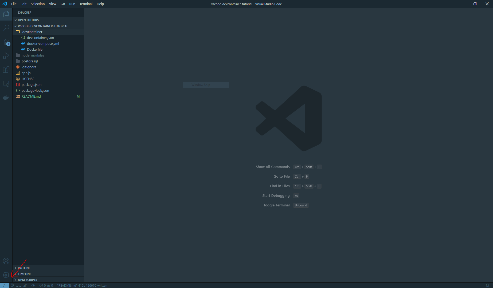
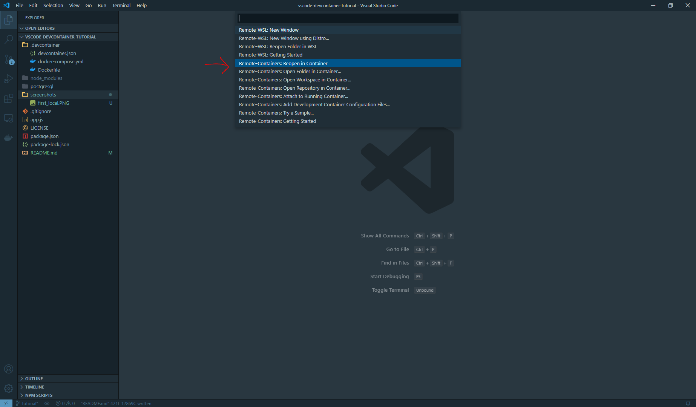
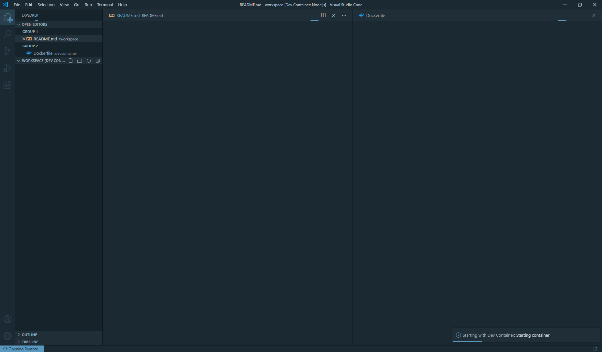

# Visual Studio Code Dev Container 튜토리얼

## 인트로

> The **Visual Studio Code Remote - Containers** extension lets you use
> a Docker container as a full-featured development environment.

개발에 필요한 툴들을 버전에 맞게 설치하고 일일히 업데이트 하는 것은
힘들고 귀찮은 일입니다.
**도커**와 **비주얼 스튜디오 코드**를 함께 사용함으로서
소프트웨어 개발 정정을 크게 개선할 수 있습니다.

이 튜토리얼에서는 `express.js` 서버와 `PostgreSQL` 데이터베이스를
포함한 개발 환경을 구축하는 것을 목표로 합니다.
이 프로젝트를 기준으로 다른 도커 컨테이너를 추가해서 사용하는 것도 좋습니다.

[도커 허브](https://hub.docker.com/)에서 찾을 수 있는
이미지 목록입니다.
어떻게 조합해서 훌륭한 프로젝트로 만들어 낼지는
창의력에 달렸습니다.

- 웹 서버
    - [아파치](https://hub.docker.com/_/httpd)
    - [Nginx](https://hub.docker.com/_/nginx)
- 데이터베이스
    - [MySQL](https://hub.docker.com/_/mysql)
    - [PostgreSQL](https://hub.docker.com/_/postgres)
    - [MongoDB](https://hub.docker.com/_/mongo)
    - [Redis](https://hub.docker.com/_/redis)
    - [Memcached](https://hub.docker.com/_/memcached)
    - [Couchbase](https://hub.docker.com/_/couchbase)
- 프로그래밍 언어 / 프레임워크
    - [노드](https://hub.docker.com/_/node)
    - [파이썬](https://hub.docker.com/_/python)
    - [자바](https://hub.docker.com/_/openjdk)
    - [Php](https://hub.docker.com/_/php)
    - [Go](https://hub.docker.com/_/golang)
    - [러스트](https://hub.docker.com/_/rust)

---

## 튜토리얼 요구사항
튜토리얼에 들어가기 앞서
**도커**, **비주얼 스튜디오 코드**, **Remote - Containers** VSCode 익스텐션이
컴퓨터에 설치되어 있어야 합니다.

아래의 링크에서 설치 방법을 찾을 수 있습니다:
- 도커: <https://docs.docker.com/get-docker/>
- 비주얼 스튜디오 코드: <https://code.visualstudio.com/download>
- Remote - Containers: <https://marketplace.visualstudio.com/items?itemName=ms-vscode-remote.remote-containers>


---

## 자, 그럼 시작합시다
데브 컨테이너를 작동시키려면,
설정 파일 세개를 작성해야 합니다:
- `.devcontainer/Dockerfile`
- `.devcontainer/docker-compose.yml`
- `.devcontainer/devcontainer.json`

각각의 파일을 살펴보고, 어떤 역할을 하는지 알아봅시다.

---

## Dockerfile
`Dockerfile`은 도커 이미지를 만들기 위한 설게도입니다.
`Dockerfile`로 만들어진 도커 이미지를 사용해서
도커 컨테이너를 생성하게 됩니다.

지금은 `Dockerfile`, 도커 이미지, 도커 컨테이너 간의 차이에
관해서 이해하지 못해도 괜찮습니다.
도커 컨테이너는 가상 머신과 거의 비슷한 역할을 하지만
도커 컨테이너가 가상 머신보다 생성/파괴/시작/종료가
쉽다는 점만 기억하세요.

만약 도커에 대해 더 자세한 설명을 원하신다면
도커 공식 문서를 참조하세요.

<https://docs.docker.com/get-started/overview/>

이게 `Dockerfile`의 첫번째 줄입니다:
```docker
FROM ubuntu:20.04
```
`Dockerfile` 은 도커 이미지의 설계도이며,
`FROM` 커맨드를 이용해서 어떤 이미지를 템플릿으로 사용할지
정할 수 있습니다. 이 파일에서는 `ubuntu:20.04`를 사용했습니다.

이어서 `Dockerfile`에서 사용할 변수들을 선언합니다:
```docker
ARG USERNAME=vscode
ARG USER_UID=1000
ARG USER_GID=$USER_UID
```

`ubuntu:20.04`의 기본 유저는 루트 계정이기 때문에,
나중에 이 변수들을 사용해서 새로운 유저를 생성할 예정입니다.

```docker
ENV DEBIAN_FRONTEND=noninteractive
```

데비안과 우분투는 `apt`라고 하는 패키지 관리자를 사용하는데,
`apt`는 파일 권한이나 시간대 설정 등의 이유로
유저 입력을 요구할 수 있습니다.
도커 이미지 생성을 완전히 자동화하기 위해서는
`apt`의 유저 입력을 비활성화 해야합니다.
`DEBIAN_FRONTEND` 환경변수가 `apt`의
유저 입력 여부를 결정합니다.

이어서, `apt`를 사용하여 도커 이미지에 필요한 패키지들을 설치합시다.

```docker
RUN apt-get -y update --no-install-recommends \
    && apt-get -y install --no-install-recommends \
    build-essential \
    curl \
    ca-certificates \
    apt-utils \
    dialog \
    git \
    vim \
    && apt-get autoremove -y \
    && apt-get clean -y
```

더 필요한 패키지가 있다면, 위 커맨드에 추가하면 됩니다.

이제 `curl`과 `ca-certificate`이 설치되었기 때문에
**Node.js**의 설치 스크립트를 다운로드하고 실행할 수 있습니다.
우분투의 패키지 저장소에는 오래된 버전의 노드만 있기 때문에, 아까
다른 패키지를 설치하면서 같이 설치하지 않았습니다.
__nodesource.com__ 에서 설치 스크립트를 다운로드 받아서
실행하고 나면, 노드 버전 12를 설치할 수 있게 됩니다.

```docker
RUN curl -sL https://deb.nodesource.com/setup_12.x | bash -
```

__nodesource.com__ 의 설치 스크립트를 실행하고 나면
`apt`를 사용해서 노드 버전 12를 설치할 수 있습니다.

```docker
RUN apt-get -y update --no-install-recommends \
    && apt-get -y install --no-install-recommends nodejs \
    && apt-get autoremove -y \
    && apt-get clean -y
```

앞에서 선언한 변수들 기억하시나요?
그 변수들을 사용해서 새로운 시스템 유저를
만들 차례입니다.

```docker
RUN groupadd --gid $USER_GID $USERNAME \
    && useradd --uid $USER_UID --gid $USER_GID -m $USERNAME
```

**NOTE**: 만약 `sudo` 커맨드를 사용하고 싶다면,
추가적인 설정이 필요합니다.
이 튜토리얼에서는 어떻게 설정하는지 다루지 않습니다.

`DEBIAN_FRONTEND` 환경변수를 다시 `dialog`로
되돌려서 도커 컨테이너를 사용할 때는
`apt`와 상호작용 할 수 있게 합니다.

```docker
ENV DEBIAN_FRONTEND=dialog
```

새로 만들어진 시스템 유저를 루트 대신 기본값으로 설정합니다.

```docker
USER $USERNAME
```

이상 `Dockerfile`에 대한 설명이었습니다.

---

## docker-compose.yml

이제 `docker-compose.yml` 파일을 살펴봅시다.

YAML은 설정 파일에 자주 쓰이는 파일 포맷입니다.
YAML에 대해서 더 알고 싶다면 공식 웹사이트를 확인하세요.

<https://yaml.org/>

`docker-compose`는 여러개의 도커 컨테이너를
한번에 다루기 위한 커맨드라인 도구입니다.
`docker-compose`가 제어하는 각각의 컨테이너는 "서비스"라고 부르고,
이 튜토리얼에서는 두개의 서비스 (express 서버 + postgres 서버)를
사용할 것입니다.

`docker-compose.yml` 는 버전 넘버로 시작합니다.

```yaml
version: '3.7'
```

이건 compose file의 버전 넘버입니다.
compose file 3.7버전은 도커 엔진 19.03 이상의
버전만 지원하기 때문에
컴퓨터에 설치된 도커 버전이 compose file을
처리할 수 있는지 꼭 확인해야 합니다.

compose file의 버전 호환성 테이블은 여기에서
찾을 수 있습니다:

<https://docs.docker.com/compose/compose-file/>

YAML에는 **anchor**이라는 기능이 있습니다.
이 기능을 이용해서 YAML 파일 안에 반복되는 부분을 **anchor**로 정의하고
이후에 **alias**를 써서 불러올 수 있습니다.

튜토리얼의 `docker-composeyml` 파일은
최상위 키 `x-environment`로 시작합니다.
"&"는 **anchor**를 의미합니다.

```yaml
x-environment:
    &default-environment
    POSTGRES_USER: vscode
    POSTGRES_PASSWORD: notsecure
    POSTGRES_DB: tutorial
```

나중에 이 anchor을 alias로 불러 올 예정입니다.

`x-environment` 키 다음에는 `docker-compose`가 관리하는
서비스들을 설정하는 `services` 키가 있습니다.

그리고 그 `services` 키는 다시 각 서비스를 나타내는
`app` 키와 `db` 키를 가집니다.

`app`을 먼저 살펴봅시다. `app`의 첫번째 키는 `build` 입니다.

```yaml
build:
    context: ..
    dockerfile: .devcontainer/Dockerfile
```

이름에서 알 수 있듯이 `build` 키는 서비스 컨테이너를 빌드하는 방법을 설정합니다.
이 경우, 빌드 컨텍스트가 `..`(상위 디렉토리)이고,
`.devcontainer/Dockerfile`을 사용해서 빌드해야 한다는 것을 알 수 있습니다.
`dockerfile`의 경로가 `context`의 상대 경로임에 주목합시다.

`app`안의 다음 키는 `environment` 이고,
이 키는 서비스 컨테이너의 환경변수를 설정합니다.

```yaml
environment:
    <<: *default-environment
    PORT: 3000
```

처음에 `default-environment` anchor을 작성한 것을 기억하나요?
`<<: *default-environment`는
"`default-environment`의 모든 값을 `environment`로 불러오시오"
라는 뜻입니다. 또한, alias 이후에 `PORT` 키가 설정된 것을 볼 수 있습니다.
`PORT` 변수는 나중에 express 서버가 어떤 포트를 listen 해야하는지
정합니다.

```yaml
ports:
    - 3000:3000
```

`ports` key here defines this port-forwarding behavior.
`PORT` 환경변수 때문에 express 서버는 3000번 포트를 listen 할 것입니다.
호스트의 포트를 컨테이너의 포트에 포워드 해주어야
이 express 서버에 접근할 수 있습니다.

자, 이제 개발을 신나게 해주는 설정을 살펴봅시다!

```yaml
volumes:
    - ..:/workspace
```

`volumes`키는 호스트 머신의 디렉토리를 서비스 컨테이너에
마운트 하게 설정합니다.
이 경우, 비주얼 스튜디오 코드의 워크스페이스를
`app`의 `/workspace` 경로에 마운트 합니다.
이렇게 설정함으로써 개발할 때 `app` 서비스 컨테이너에 접속한
상태에서 파일들을 수정할 수 있습니다.
서비스 컨테이너 안에서 수정된 파일들은
자동으로 호스트 머신과 동기화됩니다!

이게 바로 본 튜토리얼에서 만드는 세팅이 굉장한 이유입니다.
서비스 파일은 오직 `Dockerfile`에 의해서만 정의되기에,
완벽히 통제된 환경에서 개발을 진행할 수 있습니다.
컨테이너 환경에서 잘 동작하는 것은 배포 환경에서도
잘 동작할 것이고, 파이썬이나 MySQL 버전이 틀릴지 따위를
고민할 필요가 없습니다!

이제 `app`의 마지막 두 설정을 살펴봅시다.

```yaml
user: vscode
command: sleep infinity
```

`user` 키는 서비스 컨테이너의 기본 유저를 설정하고,
`command` 키는 서비스 컨테이너가 시작된 후에
무엇을 실행할지 설정합니다. 서비스 컨테이너들은
커맨드 실행이 끝나면 종료되기 때문에
`sleep infinity` 커맨드로 서비스 컨테이너를 살려둡니다.

이렇게 `app` 서비스의 설정을 알아보았습니다.

두번째 서비스는 `db` 입니다. `app` 서비스와는 다르게
`db` 서비스 컨테이너를 빌드할 때는 `Dockerfile`을 사용하지 않습니다.
그대신 **Docker Hub**에 올라와 있는 도커 이미지 하나를
사용할 것입니다.

```yaml
image: "postgres:12"
```

`image` 키를 설정하면, `docker-compose`가 해당 도커 이미지를
**Docker Hub** 에서 내려받은 후, 받아진 이미지를 기반으로
서비스 컨테이너를 생성합니다.
여기에서는 `postgres:12` 이미지를 사용합니다.

```yaml
restart: unless-stopped
```

`restart` 키는 재시작 정책을 설정합니다.
`unless-stopped` 값으로 설정하면 컨테이너를 강제로 종료하지 않는 이상
항상 컨테이너를 재시작합니다.

```yaml
environment: *default-environment
```

YAML alias가 다시 나왔습니다.
이번에는 덮어쓰는 값 없이 `default-environment`를
통채로 불러옵니다.

```yaml
ports:
    - 5432:5432
```

PostgreSQL 서버의 기본 포트는 5432 입니다.
이 포트를 포워딩 해서 PostgreSQL에 접근할 수 있도록 설정합니다.

```yaml
volumes:
    - pgdata:/var/lib/postgresql/data
    - ../postgresql/docker-entrypoint-initdb.d:/docker-entrypoint-initdb.d
```

`db` 서비스 컨테에너에는 볼륨 두개를 마운트 합니다. 첫번째 볼륨 `pgdata`는
데이터베이스 파일들을 저장하는 용도입니다.
`pgdata`가 상대경로가 아니라는 점에 주목해주세요.
`pgdata`는 **도커 볼륨**입니다. **도커 볼륨**은 도커에 의해 관리되는
특별한 저장공간이며, 컨테이너들에 마운트 할 수 있습니다.
두번째 볼륨 `../postgresql/docker-entrypoint-initdb.d/`는
초기화 스크립트를 저장하는 디렉토리입니다.
데이터베이스 파일이 존재하지 않는다면, `postgres` 컨테이너는
데이터베이스와 유저를 생성하고, `/docker-entrypoint-initdb.d`
안에 있는 모든 스크립트를 실행합니다.
튜토리얼 앱에 `todo` 테이블이 필요하기 때문에, 초기화 스크립트로
`CREATE TABLE` 구문이 들어있는 SQL 스크립트를 사용합니다.

```yaml
volumes:
    pgdata:
```

Top level `volumes` key is for defining reusable volumes.
The empty key `pgdata` here creates a docker volume
with default driver.
최상위 키 `volumes`는 재사용 가능한 볼륨을 설정할 때 씁니다.
여기에 보이는 빈 키 `pgdata`는 기본 드라이버를 사용한
도커 볼륨을 생성합니다.

---

## devcontainer.json

[출처](https://code.visualstudio.com/docs/remote/containers#_devcontainerjson-reference)

```json
{
    "name": "Node.js",
    "dockerComposeFile": "docker-compose.yml",
    "service": "app",
    "workspaceFolder": "/workspace",
    "settings": {
        "terminal.integrated.shell.linux": "/bin/bash"
    },
    "extensions": []
}
```


`devcontainer.json` 파일은 "Remote - Containers" 익스텐션의 설정을 변경합니다.
- `dockerComposeFile` : `devcontainer.json` 파일 기준 docker compose file의 상대경로.
- `service` : VS Code가 실행 후 연결하여야 하는 서비스의 이름.
- `workspaceFolder` : 컨테이너에 연결할 때 VS Code가 열어야 하는 기본 경로.
- `settings` : 컨테이너의 `settings.json` 기본값 추가.
- `extensions` : 컨테이너가 생성된 후 컨테이너 안에 설치해야 하는 익스텐션의 ID 행렬.

---

## 컨테이너 안에서 Workspace 열기

설정파일 세개를 모두 작성하였습니다.

이제 이 workspace를 데브 컨테이너 안에서 열어봅시다.

첫번째로, 아직 VS Code를 실행하지 않았다면 지금 실행하세요.
그리고, **"File > Open Folder ..."**를 선택해서 이 프로젝트의
디렉토리를 여세요.



좌측 하단에서 **"Open a remote window"** 버튼을
확인할 수 있습니다. (위 스크린샷에서 파란색 네모 버튼)
클릭해 주세요.



위의 스크린샷과 같이 VS Code 메뉴가 열립니다.
**"Remote-Containers: Reopen in Container"**를 선택하세요.



도커 이미지가 생성되고 컨테이너가 시작될때까지 시간이 소요됩니다.
몇 분 (기기에 따라 몇 초) 정도 기다리면
VS Code가 데브 컨테이너 안에서 workspace를 열어줍니다.

---

## 마치며

**축하합니다!** 성공적으로 VS Code의 workspace를
데브 컨테이너 안에서 열었고, postgres 서버도 작동합니다.

This repository provides a really simple TODO API server
in `app.js` file. Start the server and try it yourself!

이 코드 저장소의 `app.js` 파일에 초간단한 TODO API 서버 구현물이 있습니다.
서버를 실행하고 직접 테스트해 보세요!

```bash
npm ci
node app.js
```

#### REST API

| Path           | Method | Parameters   | Description        |
|----------------|--------|--------------|--------------------|
| /              | GET    |              | Hello, World!      |
| /todo          | POST   | task         | Create TODO        |
| /todo          | GET    |              | List TODO          |
| /todo/finished | POST   | id, finished | Update TODO Status |
| /todo          | DELETE | id           | Delete TODO        |
